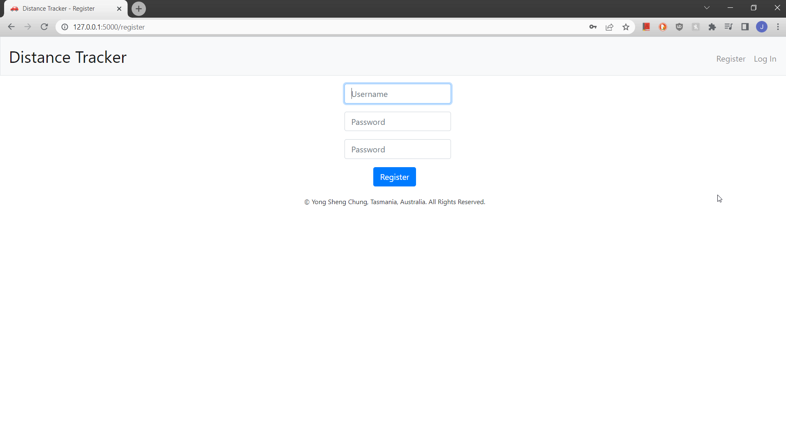
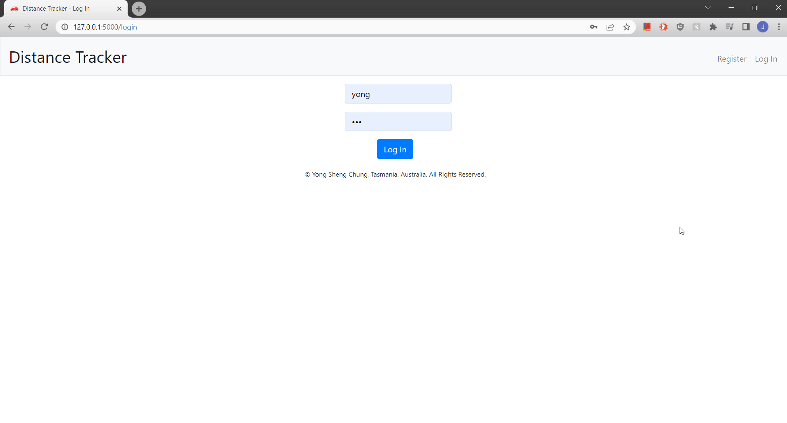
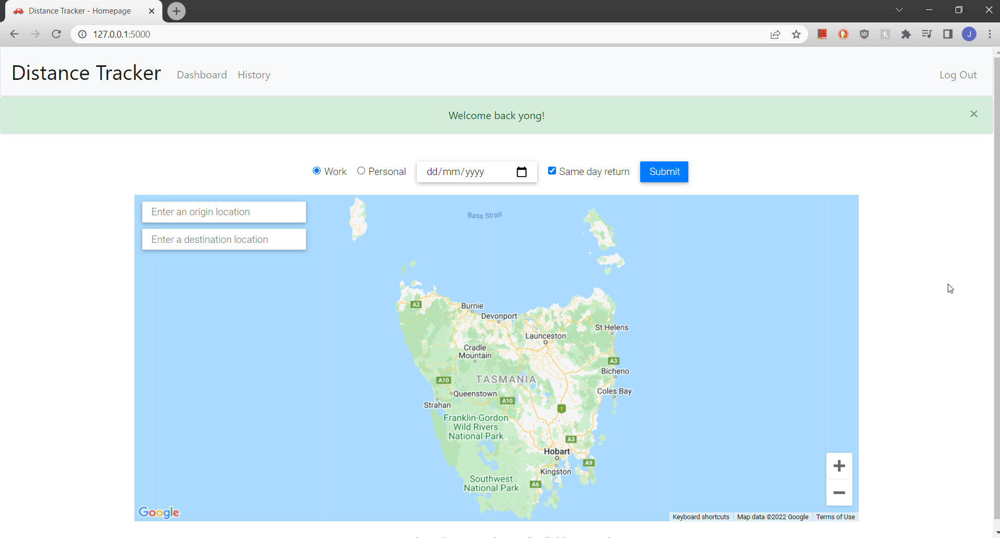
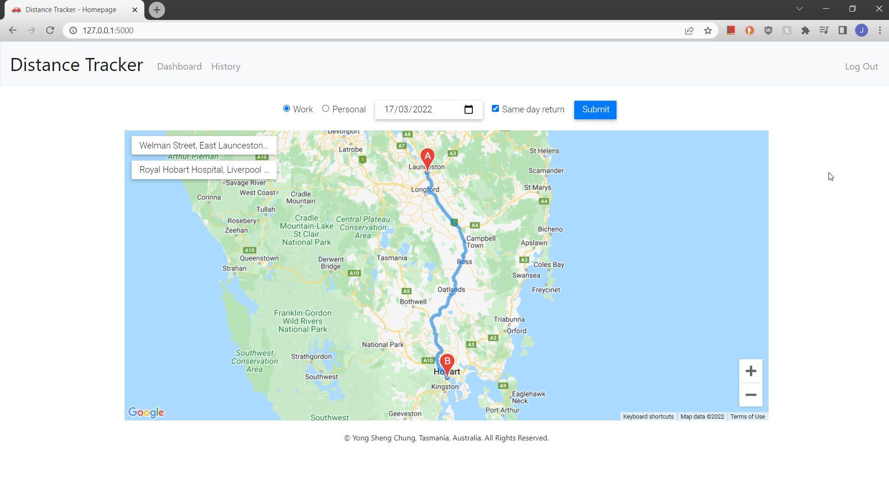
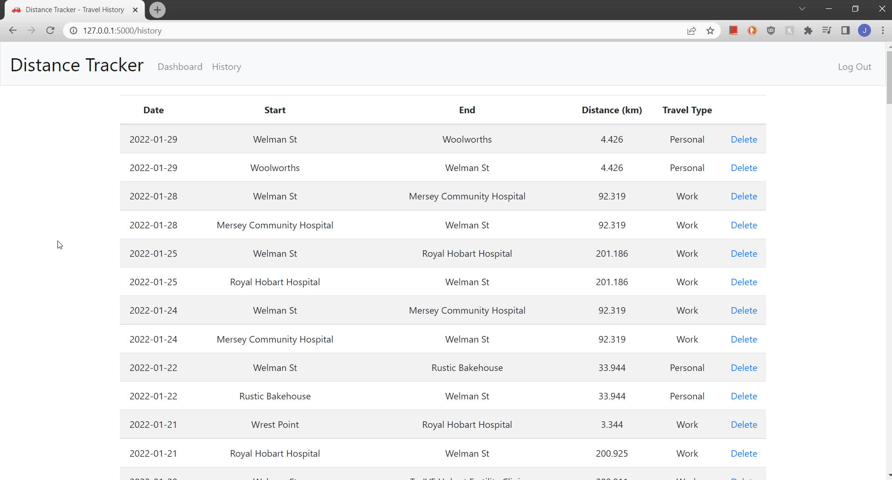
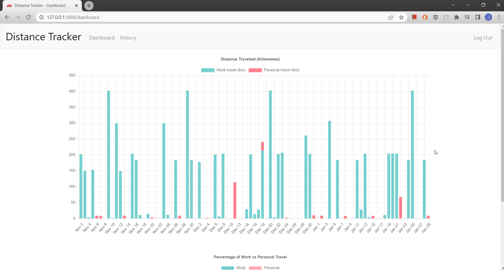
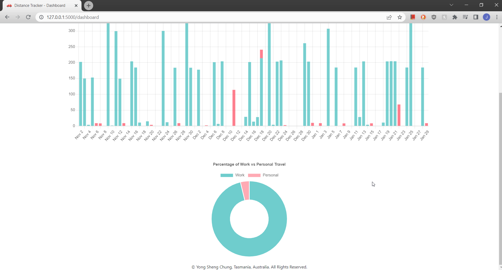

# CS50x Final Project: Vehicle Distance Tracker Web Application
## Video Demo
https://youtu.be/uTBvkuuJpQY

## Description
As a field service engineer, I have to travel around frequently to work at various locations. As I am using my own vehicle for work, I will need to keep a logbook of my vehicle use to identify the work-use percentage for tax deduction purpose. This is why the project was aiming to do.

This project was adapted from the CS50 finance project by using same concept and it is a web-based application using Python, SQLite3, HTML, CSS and Javascript. The APIs that are used in this project include Google Maps Javascript API, Directions API and Places API to calculate the distance travelled by vehicle using inputs submitted by user.

### Register and Log In

This web application allows users to create account using username and password.

This is the log in page.

On the homepage, it allows user to submit a travel record using inputs such as work or personal, date, origin location and destination location. If same day return is being checked, two trips will be recorded as shown in the video demo or the image below.

### History

Under history page, user can view the submissions in a table format. If any incorrect travel record was submitted, user can delete the record from the database by clicking the delete button.

### Dashboard

On the dashboard page, a stacked bar graph will be generated to visualise the distances traveled in each day.

Below the bar graph, a doughnut chart will be generated to visualise the percentage of work travel compared to personal travel based on the data submitted by user.

## Features
- Register new user
- Login and logout user
- Add a travel record by capturing date of travel, work/personal use, origin and destination
- Preview the travel route on map when origin and destination are selected
- View the distance travelled by user in bar graph format
- View the percentage of work related travel vs personal travel as a doughnut chart
- View and delete the record in history page

## Credits
The idea and approach was dadapted from
- [C$50 Finance](https://cs50.harvard.edu/x/2022/psets/9/finance/)
- [Google Maps Place Autocomplete and Directions Example](https://developers.google.com/maps/documentation/javascript/examples/places-autocomplete-directions#maps_places_autocomplete_directions-javascript)

## License
This project is [GNU GPLv3](https://choosealicense.com/licenses/gpl-3.0/) licensed